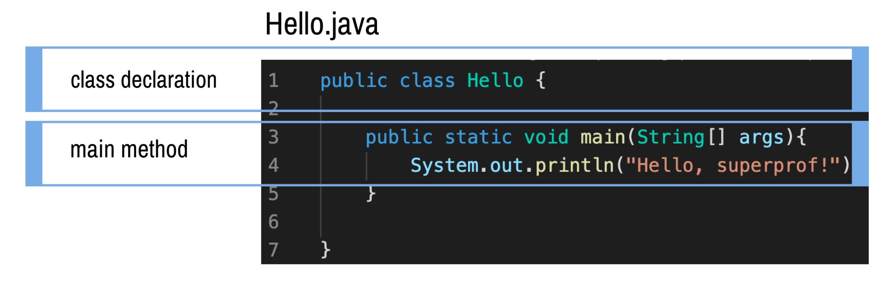
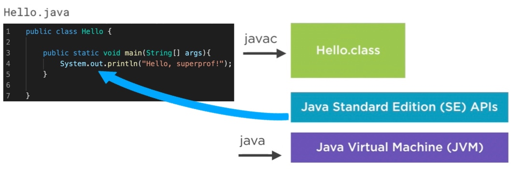

# Compiling and Running 

Consider the code below. First we have a class declaration, where we declare the class `Hello`. 

Then, we implement the method `public static void main(String[] args)`. This method simply prints to the console the text `Hello, Superprof!`.

Now, the next step is to convert our `Hello.java` into bytecode `Hello.class`. We can do it with the command `javac`. 

Finally, we send this bytecode into the `JVM` with the command `java`, so that it can transform the bytecode into machine code, to be executed by the CPU.

