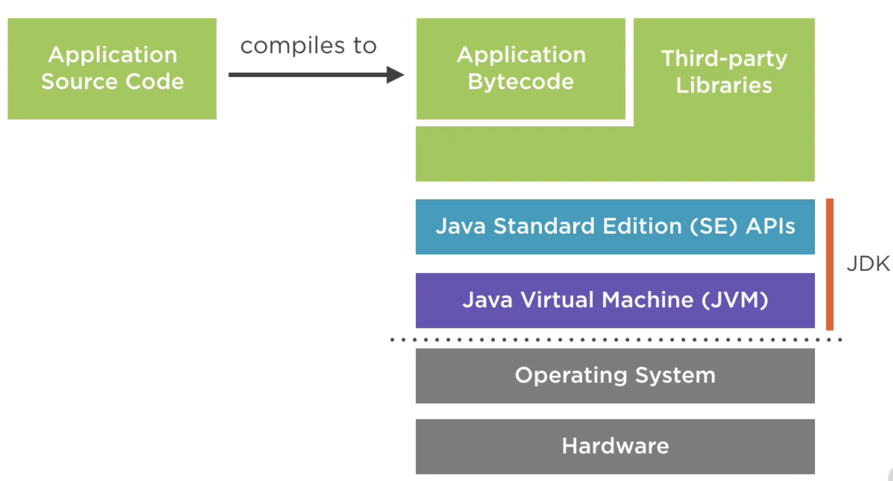

# Plataform

Java itself is composed by three big things:

- programming language
- runtime environment
- standard library

When one refers to Java, they might be refering to either one of these three, or to the whole. These three parts of the Java plataform are bundled together into the `JDK: Java Development Kit`.

This means that the base architecture of a Java application consists in the following blocks:

#### Aplication source code

The application source code is where we, developers, come in. We write our code with the `java programming language`. Here we apply the Java syntax to solve any given problem.

#### Appication bytecode

With our code code, we now compile it into bytecode. This is an intermediary state of our code, which is yet not readable by the CPU. Here, our code is put together with 3rd-party libraries we are using.

#### Java Standard Edition (SE) APIs

Finally, Java adds the bytecode of the standard functions we are using, such as `System.out` or things like that. Once this is done, we finally have the bytecode of our entire application.

#### Java Virtual Machine

Here is the final step. JVM is responsible to convert our bytecode application into CPU readable code (most likely assembly for a given processor architecture), which is then executed by the hardware.

 

### Conclusion

Java is a powerful language that bring apps to live due to is big environment. Also, it facilitates cross-plataform code, since developers compile any Java code into bytecode, that is latter processed by the user-specific JVM. 

In other words, Java is such a gigantic and commonly accepted plataform because developers can safely rely on stable 3rd party libraries, stable JVM's to different processors, easy language ramp-up, along with many other points. 